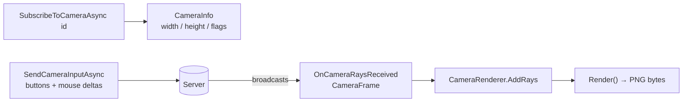

# Cameras

Rust's CCTV cameras, drones and auto-turrets stream depth/entity data over the companion API.
RustPlusApi splits this into two layers:

- **Protocol layer** (in `RustPlusApi`) — subscribe, send input, and receive typed `CameraFrame`s.
- **Session & rendering layer** (in `RustPlusApi.Camera`) — manage a camera session
  (`CameraController`: keep-alive, turret/PTZ helpers) and turn frames into images. Optional,
  so the core stays image-free.

> [!NOTE]
> Render fidelity is validated against real captured frames — a golden test in
> `RustPlusApi.Camera.UnitTests` pins the decode output to a frame sequence captured from a
> live server (2026-06-12).

## Data flow



## Identifiers

Camera identifiers are the in-game string codes configured on the camera entity via a computer
station (for example `CAM01`, `DOOR1`, `TURRET_N`). The exact string is case-sensitive and must
match what is set on the in-game computer station.

- **CCTV cameras** use the code typed into the computer station.
- **Auto-turrets** and **drones** exposed through the Rust+ API also accept string identifiers,
  but those are assigned per entity rather than user-configured; the source does not encode further
  naming conventions for them.

## Protocol layer

```csharp
var info = await rustPlus.SubscribeToCameraAsync("CAM01");   // Response<CameraInfo?>
if (!info.IsSuccess) return;

rustPlus.OnCameraRaysReceived += (_, frame) =>
{
    // frame.VerticalFov, frame.Distance, frame.RayData (RLE depth+material), frame.Entities
};

await rustPlus.SendCameraInputAsync(CameraButtons.Forward | CameraButtons.FirePrimary,
                                    mouseDeltaX: 0.1f, mouseDeltaY: 0f);

await rustPlus.UnsubscribeFromCameraAsync();
```

### `CameraInfo` properties

`SubscribeToCameraAsync` returns `CameraInfo` describing the camera:

| Property | Type | Description |
| --- | --- | --- |
| `Width` | `int` | Render width in pixels. |
| `Height` | `int` | Render height in pixels. |
| `NearPlane` | `float` | Near clip-plane distance. |
| `FarPlane` | `float` | Far clip-plane distance (maximum ray-cast range). |
| `ControlFlags` | `CameraControlFlags` | Bitmask of inputs the camera accepts. |

### `CameraControlFlags` values

| Member | Value | Meaning |
| --- | --- | --- |
| `None` | `0` | No controls available. |
| `Movement` | `1` | WASD movement is supported. |
| `Mouse` | `2` | Mouse look is supported. |
| `SprintAndDuck` | `4` | Sprint and duck inputs are supported (drones: vertical movement). |
| `Fire` | `8` | Fire inputs are supported. |
| `Reload` | `16` | Reload input is supported. |
| `Crosshair` | `32` | The camera renders a crosshair overlay. |

### `CameraButtons` enum

`CameraButtons` is a `[Flags]` enum used with `SendCameraInputAsync`:

| Member | Value | Meaning |
| --- | --- | --- |
| `None` | `0` | No button pressed. |
| `Forward` | `2` | Move forward. |
| `Backward` | `4` | Move backward. |
| `Left` | `8` | Strafe left. |
| `Right` | `16` | Strafe right. |
| `Jump` | `32` | Jump. |
| `Duck` | `64` | Crouch / duck. |
| `Sprint` | `128` | Sprint. |
| `Use` | `256` | Use / interact. |
| `FirePrimary` | `1024` | Fire primary weapon. |
| `FireSecondary` | `2048` | Fire secondary (ADS / alt-fire). |
| `Reload` | `8192` | Reload. |
| `FireThird` | `134217728` | Fire tertiary (underbarrel / melee). |

### `CameraFrame` fields

Each `CameraFrame` (delivered via `OnCameraRaysReceived`) contains:

- `VerticalFov` — vertical field-of-view in degrees.
- `SampleOffset` — index into the shuffled sample-position buffer.
- `RayData` — run-length-encoded depth/material bytes.
- `Distance` — maximum ray-cast distance used when encoding the frame.
- `Entities` — list of `CameraEntity` objects visible in the frame (id, type, position/rotation/size, name).
- `TimeOfDay` — in-game time of day when captured (`null` if not reported).
- `CameraPosition` / `CameraRotation` — world-space position and rotation (`null` if not reported).

## CameraController

`SubscribeToCameraAsync` alone is not enough for long sessions: the server stops streaming
rays for subscriptions that are not renewed. `CameraController` (in the `RustPlusApi.Camera`
package) wraps the full session — it re-subscribes every 10 seconds (configurable), forwards
frames, and exposes the press-and-release gestures PTZ cameras and auto-turrets expect:

```csharp
var response = await CameraController.SubscribeAsync(rustPlus, "TURRET01");
if (!response.IsSuccess) return;

await using var turret = response.Data!;
turret.OnFrameReceived += (_, frame) => renderer.AddRays(frame);

if (turret.IsAutoTurret)        // ControlFlags has Reload (turret-only input)
{
    await turret.ShootAsync();  // FirePrimary press + release
    await turret.ReloadAsync(); // Reload press + release
}
else
{
    // PTZ cameras only — zoom shares the FirePrimary button, so on a
    // turret this would fire instead. Cycles the zoom levels and wraps.
    await turret.ZoomAsync();
}
```

One device-kind check exists per camera type, derived from live-observed control flags:

| Check | Rule | Live-observed flags |
| --- | --- | --- |
| `IsAutoTurret` | has `Reload` (turret-only input — a drone may render a crosshair, so `Crosshair` is not a reliable marker) | `Mouse, Fire, Reload, Crosshair` |
| `IsDrone` | has `SprintAndDuck` (the drone's vertical movement controls) | `Movement, Mouse, SprintAndDuck` |
| `IsPtzCamera` | has `Mouse` but is neither turret nor drone (`Fire` drives the zoom) | `Mouse, Fire` |
| `IsStaticCamera` | `ControlFlags` is `None` | `None` |

The four checks are mutually exclusive for every flag combination observed in game.

Disposing the controller stops the keep-alive and unsubscribes. Create at most one live
controller per client — the server tracks a single camera subscription per connection.

> [!NOTE]
> Cameras are accessed while the paired player is **disconnected** from the server. If the
> camera entity itself has been destroyed in game, subscribing fails with
> `RustPlusErrorCode.NoPlayer` (`no_player`) — despite the name, the error is about the
> missing camera entity, not the player.

## Rendering layer (RustPlusApi.Camera)

`CameraRenderer` decodes the ray stream and produces a PNG. Create one per camera, sized from the
subscription, feed frames, and render:

```csharp
using RustPlusApi.Camera;

var info = (await rustPlus.SubscribeToCameraAsync("CAM01")).Data!;
var renderer = new CameraRenderer(info.Width, info.Height);

rustPlus.OnCameraRaysReceived += (_, frame) =>
{
    renderer.AddRays(frame);
    byte[] png = renderer.Render();   // save or display
};
```

Frames accumulate: each `AddRays` fills in more samples, so the image sharpens over successive
frames.
