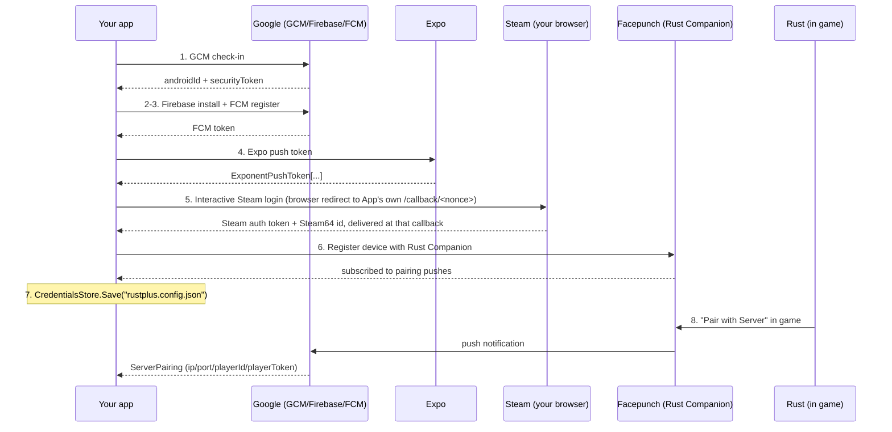

# Credentials

To use Rust+ you need credentials. There are two kinds:

- **FCM credentials** — identify your "device" to Google Firebase Cloud Messaging so you can
  receive Rust+ push notifications (used by `RustPlusFcm`).
- **Server pairing values** — `ip`, `port`, `playerId`, `playerToken` for a specific server, sent
  to you as a push notification when you choose *Pair with Server* in game (used by `RustPlus`).

The `RustPlusApi.Fcm.Registration` package acquires both natively, replacing the
`rustplus.js` Node CLI.

## The credentials website (recommended)

The fastest way to get both kinds of credentials — no .NET SDK required — is the
[Rust+ credentials website](https://github.com/HandyS11/RustPlusApi/blob/develop/apps/RustPlusApi.CredentialsWeb/README.md):
a single-page app that walks you through the Steam login in a browser and hands back the four
pairing values plus a downloadable `rustplus.config.json`.

> **Public instance:** *the public instance's URL goes here.*

Open it and sign in with Steam. Because you're not browsing from the same machine as the server,
Facepunch hands your browser a loopback address that nothing is listening on rather than
redirecting you straight back — you'll see a connection failure with that dead address in your
browser's bar. Copy the whole thing and paste it back into the page, and it picks up from there.

Prefer to run it yourself? It needs no configuration:

```bash
docker run -p 127.0.0.1:8080:8080 ghcr.io/handys11/rustplusapi-credentials
```

Then browse to <http://localhost:8080> from that same machine and Steam signs you in with the
ordinary automatic redirect instead of the paste step above — see the
[website's README](https://github.com/HandyS11/RustPlusApi/blob/develop/apps/RustPlusApi.CredentialsWeb/README.md)
for both modes and every setting.

Everything below documents the same registration chain driven directly from your own code — what
the website's server does under the hood, and the route to use if you're integrating
`RustPlusApi.Fcm.Registration` into your own app (the local route) rather than running the website.

## The flow



`FcmRegistration` orchestrates the whole chain:

```csharp
using RustPlusApi.Fcm.Registration;

var registration = new FcmRegistration();

// Steps 1–4: GCM check-in → Firebase install → FCM register → Expo token.
var credentials = await registration.AcquireCredentialsAsync();

// Steps 5–6: interactive Steam login (opens your browser) + Rust Companion device registration.
var steamLogin = await registration.RegisterWithRustPlusAsync(
    credentials,
    onLoginUrl: url => Console.WriteLine($"Open this URL to log in: {url}"));

// Step 7: persist for later runs.
CredentialsStore.Save("rustplus.config.json", credentials);

// Step 8: pair in game; one await yields the RustPlus constructor args.
using var listener = new PairingListener(credentials);
ServerPairing pairing = await listener.WaitForServerPairingAsync();
// new RustPlus(new RustPlusConnection(pairing.Ip, pairing.Port, pairing.PlayerId, pairing.PlayerToken))
```

| Step | Component | Result |
| --- | --- | --- |
| 1 | `AndroidFcmRegister.CheckInAsync` | Android id + security token |
| 2 | `AndroidFcmRegister.InstallAsync` | Firebase installation token |
| 3 | `AndroidFcmRegister.RegisterFcmAsync` | FCM token |
| 4 | `ExpoPushClient.GetTokenAsync` | Expo push token |
| 5 | `SteamLoginService.LoginAsync` | Steam auth token + Steam64 id |
| 6 | `RustCompanionClient.RegisterAsync` | device subscribed to pairing pushes |
| 7 | `CredentialsStore.Save` | `rustplus.config.json` |
| 8 | `PairingListener` | `ServerPairing` (ip/port/playerId/playerToken) |

Steps 1–7 run once. Step 8 happens every time you pair a new server in game.

## How the Steam login works

This section covers the local route — driving `SteamLoginService` yourself, as the console app
does — and it also explains what the credentials website's two modes both build on underneath.

`SteamLoginService` binds an `HttpListener` on `http://localhost:<port>/` and sends the browser to:

```
https://companion-rust.facepunch.com/login?returnUrl=http://localhost:<port>/callback/<nonce>
```

Facepunch carries that `returnUrl` through the Steam OpenID round-trip and redirects the browser
back to it with the credentials appended:

```
http://localhost:<port>/callback/<nonce>?steamId=765611…&token=eyJhbGciOi…
```

Facepunch decides whether to honour that redirect purely from the *shape* of `returnUrl` — a
loopback address always qualifies, whether or not anything is actually listening there, because
Facepunch's own servers cannot reach your `localhost` any more than they can reach an unroutable LAN
address. What happens next depends on whether something is actually listening at that address:

- **Something is** — the console app's own `HttpListener`, or the credentials website running on
  the machine you're browsing from. The redirect lands there directly and the flow continues with
  no visible extra step.
- **Nothing is** — the credentials website, reached from anywhere else. The browser fails to
  connect and shows the dead `http://localhost:<port>/callback/<nonce>?...` address, Steam token
  included, right in its address bar. The visitor copies that address and pastes it back into the
  page they started from, which parses it exactly as if the redirect had arrived on its own. This
  was verified against the live Facepunch endpoint on 2026-09-06, from a non-loopback origin.

Any browser works — nothing is injected into the page. `SteamLoginService.LoginAsync` opens your
default browser on a best-effort basis and always reports the URL through its `onLoginUrl`
callback first, so the flow still completes on a container or over SSH by opening the link by hand.

The callback path carries a per-run random nonce, and any request to a different path is answered
with a 404 and ignored, so a page you happen to be browsing cannot push a token of its own choosing
into the listener. The response page calls `history.replaceState` to strip the token from the URL
your browser records.

`port` defaults to `3000`; pass `steamLoginPort: 0` to `FcmRegistration` to have a free port picked
automatically if 3000 is taken.

## Upstream fragility

Every network step depends on live Google, Expo and Facepunch services, whose endpoints and
constants drift when those apps change. The flow is ported from rustplus.js /
`@liamcottle/push-receiver`; if registration breaks, re-check `RegistrationConstants` against
those upstream sources. The offline test suite covers the deterministic parts; the live flow is
validated by running the `RustPlus.Register.ConsoleApp` sample end to end.

The Steam login is the most exposed of these. Facepunch has already moved its own app off the
`returnUrl` redirect and onto a `ReactNativeWebView.postMessage` bridge, keeping the redirect only
for loopback addresses. Everything here — `SteamLoginService`, the console sample and the
credentials website alike — depends on that remaining branch. If it is retired, the callback simply
never arrives and the login waits indefinitely rather than failing with a diagnostic.

## Loading credentials back

```csharp
var credentials = CredentialsStore.Load("rustplus.config.json");
var listener = new RustPlusFcm(credentials);
```

The legacy rustplus.js `rustplus.config.json` format is also accepted by the FCM sample's loader.

> [!WARNING]
> `rustplus.config.json` contains long-lived push credentials (the GCM security token and
> FCM/Expo tokens) in plain JSON — anyone who can read the file can receive your pairing
> notifications. Treat it like a password file: keep it out of version control and shared
> directories. On .NET 10+ on Linux/macOS, `CredentialsStore.Save` restricts it to owner
> read/write; on other targets, restrict permissions yourself.
