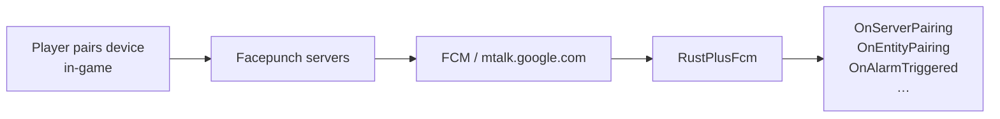

# FCM Notifications

`RustPlusFcm` (in `RustPlusApi.Fcm`) connects to Firebase Cloud Messaging and raises events when
Rust+ sends push notifications — pairing requests and alarm triggers.

## How notifications reach your app



## Connect

```csharp
using RustPlusApi.Fcm;
using RustPlusApi.Fcm.Registration;

var credentials = CredentialsStore.Load("rustplus.config.json");
var listener = new RustPlusFcm(credentials, persistentIds: null);
await listener.ConnectAsync();
// …
listener.Disconnect();
```

`persistentIds` is an optional `ICollection<string>` of already-seen notification IDs to skip on
reconnect. Pass the same collection instance across reconnects — the socket appends every newly-seen
ID to it as they arrive, so passing it back to a new instance automatically deduplicates replays.
Prefer a `HashSet<string>` — the collection is consulted on every message and grows for the lifetime of the listener, so a `List<string>`'s linear scan degrades over long sessions.

## Events

| Event | Payload type | Fires when |
| --- | --- | --- |
| `OnPairing` | `FcmMessage` | Any pairing FCM message is received (raw). |
| `OnEntityPairing` | `Notification<EntityEvent?>` | You pair a smart device (superset of the three below). |
| `OnSmartSwitchPairing` | `Notification<ulong?>` | A smart switch is paired (entity ID in `Data`). |
| `OnSmartAlarmPairing` | `Notification<ulong?>` | A smart alarm is paired (entity ID in `Data`). |
| `OnStorageMonitorPairing` | `Notification<ulong?>` | A storage monitor is paired (entity ID in `Data`). |
| `OnServerPairing` | `Notification<ServerEvent?>` | You choose *Pair with Server* in game — carries ip/port/playerId/playerToken. |
| `OnAlarmTriggered` | `AlarmEvent?` | A paired smart alarm fires. |

Socket lifecycle events (from `IRustPlusFcmSocket`):

| Event | Payload type | Fires when |
| --- | --- | --- |
| `Connecting` | `EventArgs` | `ConnectAsync` is called, before TLS handshake. |
| `Connected` | `EventArgs` | TLS handshake and MCS login completed. |
| `NotificationReceived` | `string` | A raw FCM notification JSON string is received. |
| `SocketClosed` | `EventArgs` | The server sent a close tag. |
| `Disconnecting` | `EventArgs` | `Disconnect` is called. |
| `Disconnected` | `EventArgs` | The receive loop has stopped. |
| `ErrorOccurred` | `Exception` | An unhandled error occurred on the receive loop. |

```csharp
listener.OnServerPairing += (_, e) =>
    Console.WriteLine($"Pair: {e.Data?.Ip}:{e.Data?.Port} (player {e.PlayerId})");

listener.OnAlarmTriggered += (_, alarm) =>
    Console.WriteLine($"Alarm: {alarm?.Title}");
```

> [!NOTE]
> The listener sends its own MCS heartbeat ping every **5 minutes** (to keep NAT/firewall
> mappings alive) and watches for inactivity: if no frame arrives for **12 minutes**, the
> connection is presumed dead — `ErrorOccurred` fires with a `TimeoutException` and the socket
> disconnects so you can create a fresh listener. Both intervals are tunable via
> `RustPlusFcmSocketOptions`.

```csharp
var listener = new RustPlusFcm(credentials, options: new RustPlusFcmSocketOptions
{
    HeartbeatInterval = TimeSpan.FromMinutes(2),
    InactivityTimeout = TimeSpan.FromMinutes(6)
});
```

## Reconnect strategy

`RustPlusFcm` is single-connection: after `Disconnect()` or disposal you must create a new
instance. The pattern below handles `ErrorOccurred` (including the `TimeoutException` raised by the
inactivity watchdog) with exponential back-off, and passes the same `persistentIds` collection so
notifications already processed are not replayed.

```csharp
var credentials = CredentialsStore.Load("rustplus.config.json");

// Persist this collection across reconnects to deduplicate replayed notifications.
ICollection<string> persistentIds = new HashSet<string>();

RustPlusFcm? listener = null;
var delay = TimeSpan.FromSeconds(5);
const int MaxDelaySeconds = 300;

async Task ConnectWithRetryAsync(CancellationToken ct)
{
    while (!ct.IsCancellationRequested)
    {
        listener?.Disconnect();
        listener?.Dispose();

        listener = new RustPlusFcm(credentials, persistentIds);

        listener.OnAlarmTriggered += (_, alarm) =>
            Console.WriteLine($"Alarm: {alarm?.Title}");

        listener.ErrorOccurred += async (_, ex) =>
        {
            Console.WriteLine($"FCM error ({ex.GetType().Name}): {ex.Message}");
            // Back off then reconnect.
            await Task.Delay(delay, ct);
            delay = TimeSpan.FromSeconds(Math.Min(delay.TotalSeconds * 2, MaxDelaySeconds));
            _ = ConnectWithRetryAsync(ct);
        };

        try
        {
            await listener.ConnectAsync(ct);
            delay = TimeSpan.FromSeconds(5); // reset back-off on success
            break;
        }
        catch (Exception ex) when (ex is not OperationCanceledException)
        {
            Console.WriteLine($"Connect failed: {ex.Message}");
            await Task.Delay(delay, ct);
            delay = TimeSpan.FromSeconds(Math.Min(delay.TotalSeconds * 2, MaxDelaySeconds));
        }
    }
}

await ConnectWithRetryAsync(CancellationToken.None);
```

## One-await pairing

For the common "wait for the next server pairing" case, `RustPlusApi.Fcm.Registration` provides
`PairingListener`, which wraps `RustPlusFcm` and returns a strongly-typed `ServerPairing`:

```csharp
using var pairing = new PairingListener(credentials);
ServerPairing server = await pairing.WaitForServerPairingAsync();
using var rustPlus = new RustPlus(new RustPlusConnection(server.Ip, server.Port, server.PlayerId, server.PlayerToken));
```

See [Credentials](credentials.md) for how to obtain the FCM credentials.
