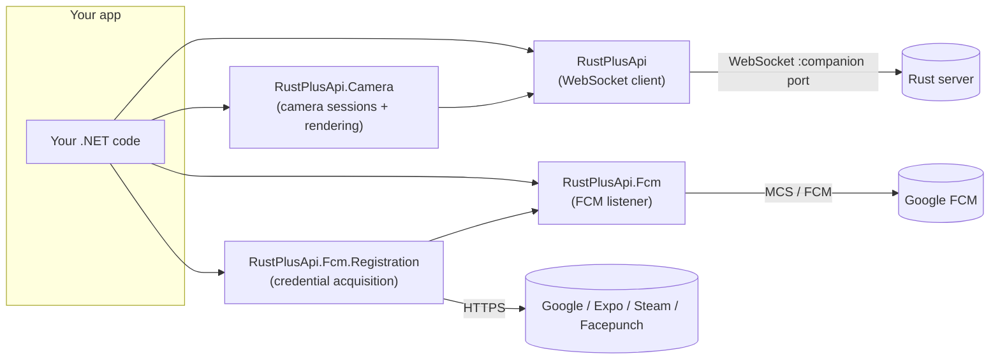

# Introduction

RustPlusApi is a C# library for the [Rust+](https://rust.facepunch.com/companion) companion API —
the same API the official Rust+ mobile app uses to talk to a Rust game server. With it you can
read server state, control smart devices, watch security cameras, chat with your team/clan, and
receive push notifications, all from .NET.

There is no official public schema for the Rust+ protocol; it is reverse-engineered by the
community. RustPlusApi is grandly inspired by
[liamcottle/rustplus.js](https://github.com/liamcottle/rustplus.js).

## The packages

The library is split so you only take the dependencies you need.

| Package | What it does | Depends on |
| --- | --- | --- |
| **RustPlusApi** | Core WebSocket client with a typed `Response<T>` API: info, time, map, markers, team & clan chat, nexus auth, entities (smart switch / alarm / storage monitor) and the camera protocol. | protobuf-net |
| **RustPlusApi.Fcm** | Listens to Firebase Cloud Messaging for server/entity **pairing** and **alarm** notifications. | protobuf-net, System.Text.Json |
| **RustPlusApi.Fcm.Registration** | Acquires all the credentials natively (GCM check-in → Firebase → FCM → Expo → Steam → Rust Companion). Replaces the `rustplus.js` Node CLI. | RustPlusApi.Fcm |
| **RustPlusApi.Camera** | Manages camera sessions (`CameraController`: keep-alive, turret/PTZ helpers) and renders frames into images. | RustPlusApi, SixLabors.ImageSharp |

## Target frameworks

Everything targets **.NET Standard 2.0** and **.NET 10**, so the libraries run on .NET Framework
4.6.2+, .NET 6–10, Mono and Unity. The `net10.0` build uses modern BCL fast-paths; the
`netstandard2.0` build keeps the reach.

## How it fits together

**1. Get credentials once** — `RustPlusApi.Fcm.Registration` drives the full chain: GCM check-in,
Firebase installation, FCM token, Expo push token, an interactive Steam login in your own browser,
and a Rust Companion device registration. The result is a `rustplus.config.json` you load on every
subsequent run. After that, pairing a server in game pushes four values — server IP, companion
port, your SteamID64, and a per-server token — straight to your app via FCM. See
[Credentials](credentials.md) for the step-by-step flow.

**2. Talk to the server** — `RustPlusApi` opens a WebSocket to the companion port and exposes a
typed `Response<T>` API: server info, time, map, markers, team and clan chat, smart entities,
camera subscription, and Nexus cross-server auth. See [RustPlus Client](rustplus-client.md) for the
full surface.

**3. Listen for notifications** — `RustPlusApi.Fcm` maintains a persistent MCS connection to
Google FCM and surfaces server-pairing events, smart-alarm triggers, and entity pairing
notifications as strongly-typed .NET events. See [FCM Notifications](fcm-notifications.md).

**4. Watch cameras** (optional) — `RustPlusApi.Camera` manages the session (`CameraController`) and converts the raw `AppCameraRays` protobuf
frames from the WebSocket stream into images using SixLabors.ImageSharp. See
[Cameras](cameras.md).

Start with [Getting Started](getting-started.md).
