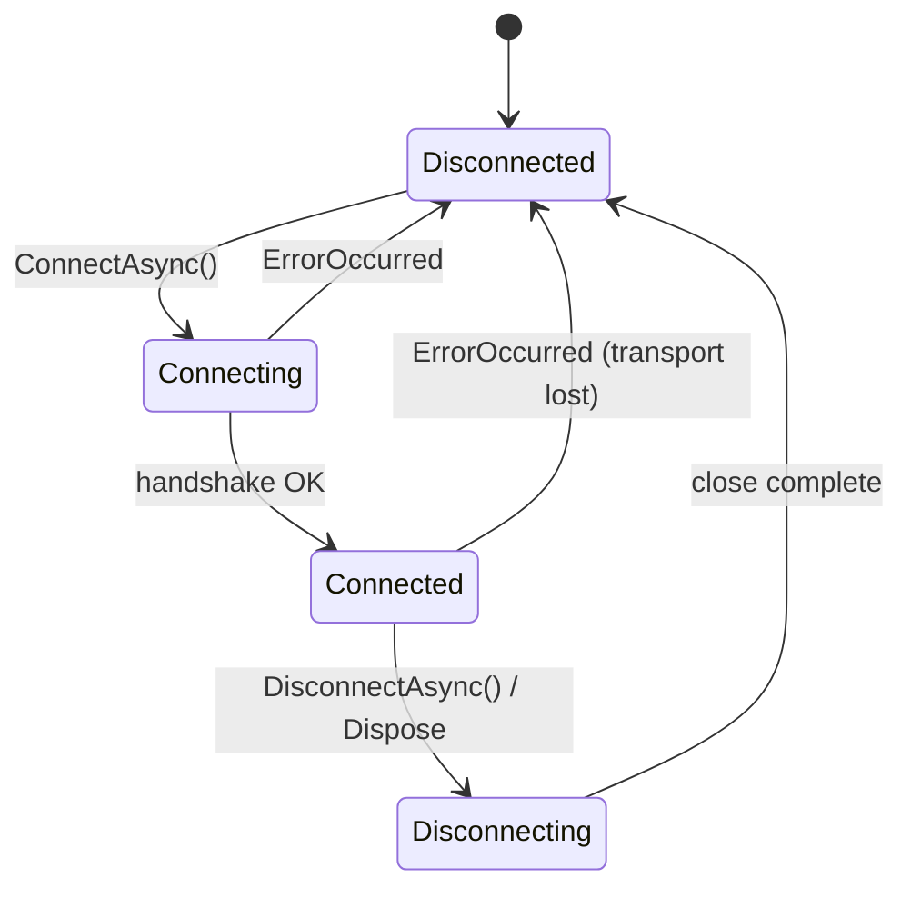

# RustPlus Client

`RustPlus` is the core client. It opens a WebSocket to the server's companion port and exposes a
typed, task-based API.

## Construct and connect

```csharp
using var rustPlus = new RustPlus(new RustPlusConnection(server, port, playerId, playerToken, UseFacepunchProxy: false));
await rustPlus.ConnectAsync();
```

| Parameter | Meaning |
| --- | --- |
| `server` | The server's IP address. |
| `port` | The Rust+ companion port (not the in-game connect port). |
| `playerId` | Your Steam ID. |
| `playerToken` | The player token from pairing. |
| `useFacepunchProxy` | Route through the Facepunch proxy instead of connecting directly. |

## Connection lifecycle

The client progresses through the following states. `ErrorOccurred` can fire from both the
`Connecting` and `Connected` states (for example, a WebSocket connection failure or a dead-socket
receive error).



After `DisconnectAsync()` the instance can reconnect by calling `ConnectAsync()` again — it opens a
fresh socket without leaking the previous one.

## The `Response<T>` contract

Every request returns a `Response<T>`:

```csharp
public sealed record Response<T>
{
    public bool IsSuccess { get; init; }
    public ErrorMessage? Error { get; init; }
    public T? Data { get; init; }
}
```

Always check `IsSuccess` before reading `Data`:

```csharp
var time = await rustPlus.GetTimeAsync();
if (time.IsSuccess)
    Console.WriteLine(time.Data!.Time);
else
    Console.WriteLine(time.Error!.Message);
```

## Method reference

### Server & world

| Method | Returns | Notes |
| --- | --- | --- |
| `GetInfoAsync()` | `Response<ServerInfo?>` | Name, player counts, map size, wipe time, logo URL. |
| `GetTimeAsync()` | `Response<TimeInfo?>` | In-game time, sunrise/sunset, day-length parameters. |
| `GetMapAsync()` | `Response<ServerMap?>` | Map image bytes and monument list. Large response — cache it. |
| `GetMapMarkersAsync()` | `Response<MapMarkers?>` | Players, cargo ship, patrol heli, vending machines, CH-47, events. |

### Entities (smart devices)

| Method | Returns | Notes |
| --- | --- | --- |
| `GetSmartSwitchInfoAsync(entityId)` | `Response<SmartSwitchInfo?>` | Current on/off state. |
| `GetAlarmInfoAsync(entityId)` | `Response<AlarmInfo?>` | Current state (protocol-level identical to smart switch). |
| `GetStorageMonitorInfoAsync(entityId)` | `Response<StorageMonitorInfo?>` | Item list and protection state. |
| `SetSmartSwitchValueAsync(entityId, value)` | `Response<SmartSwitchInfo?>` | `true` = on, `false` = off. Reply is the EntityChanged broadcast. |
| `ToggleSmartSwitchAsync(entityId)` | `Response<SmartSwitchInfo?>` | Reads current state then flips it. |
| `StrobeSmartSwitchAsync(entityId, timeoutMilliseconds, value)` | `Response<SmartSwitchInfo?>` | Pulses to `value`, waits `timeoutMilliseconds`, then reverts. Default: 1 s on. |
| `CheckSubscriptionAsync(alarmId)` | `Response<SubscriptionInfo?>` | Whether you are subscribed to a smart alarm. |
| `SetSubscriptionAsync(entityId, doSubscribe)` | `Response` | Subscribe (`true`) or unsubscribe (`false`) from push notifications. |

### Team

| Method | Returns | Notes |
| --- | --- | --- |
| `GetTeamInfoAsync()` | `Response<TeamInfo?>` | All members, statuses, map notes. |
| `GetTeamChatAsync()` | `Response<TeamChatInfo?>` | Recent team chat history. |
| `SendTeamMessageAsync(message)` | `Response<TeamMessage?>` | Sends text; reply is the echo broadcast for your own message. |
| `PromoteToLeaderAsync(steamId)` | `Response` | Promotes the specified team member to leader. |

### Clan

| Method | Returns | Notes |
| --- | --- | --- |
| `GetClanInfoAsync()` | `Response<ClanInfo?>` | Full clan snapshot: roles, members, invites, MOTD. |
| `GetClanChatAsync()` | `Response<ClanChatInfo?>` | Recent clan chat history. |
| `SendClanMessageAsync(message)` | `Response` | Posts a message to clan chat. |
| `SetClanMotdAsync(message)` | `Response` | Sets the clan message of the day. |

### Nexus

| Method | Returns | Notes |
| --- | --- | --- |
| `GetNexusAuthAsync(appKey)` | `Response<NexusAuth?>` | Cross-server auth token for Nexus-enabled servers. |

### Cameras

| Method | Returns | Notes |
| --- | --- | --- |
| `SubscribeToCameraAsync(cameraId)` | `Response<CameraInfo?>` | Starts the `OnCameraRaysReceived` stream; returns width/height/flags. |
| `SendCameraInputAsync(buttons, mouseDeltaX, mouseDeltaY)` | `Response` | Sends movement/action input to the subscribed camera. |
| `UnsubscribeFromCameraAsync()` | `Response` | Stops the camera stream. |

### Low-level

| Method | Returns | Notes |
| --- | --- | --- |
| `SendRequestAsync(request, broadcastReplyMatcher)` | `Task<AppMessage>` | Raw protobuf request. Use for operations not covered by typed methods. |

## Events

The complete set of public events across `RustPlusSocket` and `RustPlus`:

| Event | Payload type | Fires when |
| --- | --- | --- |
| `Connecting` | `EventArgs` | `ConnectAsync` is called, before the WebSocket handshake. |
| `Connected` | `EventArgs` | The WebSocket handshake completed successfully. |
| `SendingRequest` | `EventArgs` | A request is about to be written to the send channel. |
| `RequestSent` | `AppRequest` | A request was serialised and sent over the socket. |
| `MessageReceived` | `AppMessage` | Any message (response or broadcast) was received. |
| `NotificationReceived` | `AppMessage` | An unsolicited broadcast was received. |
| `ResponseReceived` | `AppMessage` | A seq-bearing response was received. |
| `Disconnecting` | `EventArgs` | `DisconnectAsync` started the close handshake. |
| `Disconnected` | `EventArgs` | The WebSocket close completed. |
| `ErrorOccurred` | `Exception` | A transport or receive error occurred. Fires from Connecting or Connected state. |
| `OnSmartSwitchTriggered` | `SmartSwitchEventArg` | A subscribed smart switch or alarm changed state. |
| `OnStorageMonitorTriggered` | `StorageMonitorEventArg` | A subscribed storage monitor reported a change. |
| `OnTeamChatReceived` | `TeamMessageEventArg` | A team chat message arrived. |
| `OnClanChatReceived` | `ClanMessageEventArg` | A clan chat message arrived. |
| `OnClanChanged` | `ClanChangedEventArg` | The clan snapshot changed (roles, members, MOTD, …). |
| `OnCameraRaysReceived` | `CameraRaysEventArg` | A camera frame broadcast arrived for the subscribed camera. |

> [!NOTE]
> To receive `OnSmartSwitchTriggered` or `OnStorageMonitorTriggered` broadcasts for a given
> entity, you must first make at least one request on that entity (e.g. `GetSmartSwitchInfoAsync`),
> which registers it with the server. Camera frame events start after `SubscribeToCameraAsync`.

## Disposal

`RustPlus` is `IDisposable`; dispose it (or `await DisconnectAsync()`) when done.

```csharp
await rustPlus.DisconnectAsync();
```

`DisposeAsync()` is also available and drains background I/O loops before releasing the socket.
