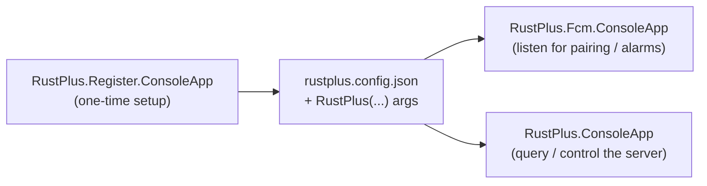

# Samples

The repository ships three runnable console apps under [`samples/`](https://github.com/HandyS11/RustPlusApi/tree/develop/samples)
that fit together as one flow:



> [!IMPORTANT]
> Credentials are never committed. The query and listener apps ship a placeholder template
> (`RustPlus.ConsoleApp/credentials.sample.json` /
> `RustPlus.Fcm.ConsoleApp/sample-config.json`); you create the real `credentials.json` /
> `rustplus.config.json` locally — both are gitignored. The Register app needs no template, it
> generates `rustplus.config.json` for you.

## RustPlus.Register.ConsoleApp — get your credentials (start here)

The native, C#-only replacement for `npx @liamcottle/rustplus.js fcm-register`. It performs the
GCM/Firebase/FCM/Expo registration, opens **Chrome/Chromium** for the Steam login, registers with
Rust Companion, writes `rustplus.config.json`, then waits for you to pair in game.

```bash
dotnet run --project samples/RustPlus.Register.ConsoleApp
```

- Requires Chrome or Chromium (native or Flatpak; `CHROME_PATH` overrides
  [discovery](credentials.md#browser-discovery-order)). Firefox/Safari won't work.
- After the Steam login, open Rust → join your server → **Pair with Server**.
- It prints the absolute path of the saved `rustplus.config.json` and the
  `new RustPlus(new RustPlusConnection(ip, port, playerId, playerToken))` line to use with the other samples.

## RustPlus.Fcm.ConsoleApp — listen for notifications

Listens for pairing/alarm notifications using the credentials from the register app.

```bash
# Copy the config produced by the Register app next to this project, then:
dotnet run --project samples/RustPlus.Fcm.ConsoleApp
# or pass the path explicitly:
dotnet run --project samples/RustPlus.Fcm.ConsoleApp -- /path/to/rustplus.config.json
```

It reads `rustplus.config.json` (the native format) and also accepts the legacy `rustplus.js`
config layout as a fallback — see [Troubleshooting](troubleshooting.md) if notifications don't
arrive.

## RustPlus.ConsoleApp — query and control a server

Interactive menu covering the full `IRustPlus` surface:

| Menu | What it exercises |
| --- | --- |
| **Common** | Server info, map (saved to `map.jpg`), map markers, time, Nexus auth. |
| **Team** | Team info, team chat, promote to leader, send message. |
| **Clan** | Clan info, clan chat, send message, set MOTD. |
| **Electricity** | Alarms, subscriptions, storage monitors, smart switches (get/set/strobe/toggle). |
| **Camera** | Subscribe and stream frames as an ASCII preview, send movement input, unsubscribe. |
| **Live Events** | Stream smart-switch, storage-monitor, team/clan chat and clan-change events live. |

Entity ids (alarm / smart switch / storage monitor / camera) are remembered for the session —
press Enter at a prompt to reuse the last value. Camera rendering uses the
[RustPlusApi.Camera](cameras.md) package and is experimental.

```bash
# Copy credentials.sample.json to credentials.json and fill in the values
# printed by the Register app (ip / port / playerId / playerToken), then:
dotnet run --project samples/RustPlus.ConsoleApp
# or pass the path explicitly:
dotnet run --project samples/RustPlus.ConsoleApp -- /path/to/credentials.json
```

## Where the apps look for config

By default each app reads its config from its **build output directory**; the `.csproj` copies a
`credentials.json` / `rustplus.config.json` placed next to the project into the output on build.
The simplest workflow is: put the file in the project folder and `dotnet run`. You can always
override the location by passing the path as the first argument.
