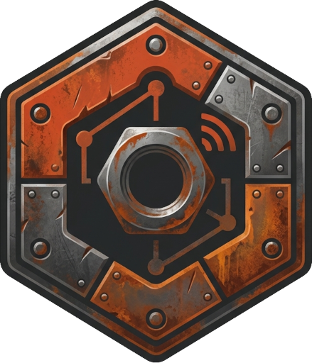

<div class="rp-hero">
  
  <h1>RustPlusApi</h1>
  <p class="rp-tagline">
    A C# library for the <a href="https://rust.facepunch.com/companion">Rust+</a> companion API.
    Query and control your server, render security cameras, listen for push notifications, and
    acquire all the required credentials natively — <em>no Node.js required</em>.
  </p>
  <div class="rp-cta">
    <a class="btn btn-primary" href="articles/getting-started.md">Get Started</a>
    <a class="btn btn-outline-secondary" href="api/RustPlusApi.yml">API Reference</a>
  </div>
  <p class="rp-badges">
    
    
    
  </p>
</div>

<div class="rp-grid">
  <a class="rp-card" href="articles/rustplus-client.md">
    <div class="rp-card-icon">🖥️</div>
    <h3>Server control</h3>
    <p>Info, time, map &amp; markers, smart switches, alarms, storage monitors — one typed <code>Response&lt;T&gt;</code> API.</p>
  </a>
  <a class="rp-card" href="articles/clan-and-nexus.md">
    <div class="rp-card-icon">💬</div>
    <h3>Team &amp; clan</h3>
    <p>Read and send team/clan chat, manage the MOTD, react to broadcasts, authenticate with Nexus.</p>
  </a>
  <a class="rp-card" href="articles/cameras.md">
    <div class="rp-card-icon">📷</div>
    <h3>Cameras</h3>
    <p>Subscribe to CCTV, drones and turrets, drive them, and render frames to PNG images.</p>
  </a>
  <a class="rp-card" href="articles/fcm-notifications.md">
    <div class="rp-card-icon">🔔</div>
    <h3>Notifications</h3>
    <p>Receive pairing and alarm pushes over FCM with automatic heartbeat &amp; dead-connection detection.</p>
  </a>
  <a class="rp-card" href="articles/credentials.md">
    <div class="rp-card-icon">🔑</div>
    <h3>Native credentials</h3>
    <p>Acquire FCM + Rust+ credentials end to end in C#, replacing the rustplus.js Node CLI.</p>
  </a>
  <a class="rp-card" href="articles/introduction.md">
    <div class="rp-card-icon">🎯</div>
    <h3>Broad targeting</h3>
    <p>.NET Standard 2.0 and .NET 10 — runs on .NET Framework 4.6.2+, .NET 6–10, Mono and Unity.</p>
  </a>
</div>

## Packages

| Package | Downloads | Description |
| --- | --- | --- |
| **[RustPlusApi](xref:RustPlusApi)** | [](https://www.nuget.org/packages/RustPlusApi) | Core client — typed `Response<T>` API, entities, team/clan/nexus, camera protocol. |
| **[RustPlusApi.Fcm](xref:RustPlusApi.Fcm)** | [](https://www.nuget.org/packages/RustPlusApi.Fcm) | FCM listener for pairing & alarm notifications. |
| **[RustPlusApi.Fcm.Registration](xref:RustPlusApi.Fcm.Registration)** | [](https://www.nuget.org/packages/RustPlusApi.Fcm.Registration) | Native credential acquisition (no Node.js). |
| **[RustPlusApi.Camera](xref:RustPlusApi.Camera)** | [](https://www.nuget.org/packages/RustPlusApi.Camera) | Camera sessions (`CameraController`: keep-alive, turret/PTZ helpers) and frame rendering (ImageSharp). |
| **[RustPlusApi.Extensions.DependencyInjection](xref:RustPlusApi.Extensions.DependencyInjection)** | [](https://www.nuget.org/packages/RustPlusApi.Extensions.DependencyInjection) | DI registration (`AddRustPlus`, `IRustPlusFactory`) for the core client. |
| **[RustPlusApi.Fcm.Extensions.DependencyInjection](xref:RustPlusApi.Fcm.Extensions.DependencyInjection)** | [](https://www.nuget.org/packages/RustPlusApi.Fcm.Extensions.DependencyInjection) | DI registration (`AddRustPlusFcm`, `IRustPlusFcmFactory`) for the FCM listener. |

## Quickstart

```csharp
using RustPlusApi;

using var rustPlus = new RustPlus(new RustPlusConnection(server, port, playerId, playerToken));
await rustPlus.ConnectAsync();

var info = await rustPlus.GetInfoAsync();
if (info.IsSuccess)
    Console.WriteLine($"{info.Data!.Name} — {info.Data.PlayerCount}/{info.Data.MaxPlayerCount}");
```

Don't have credentials yet? The **[Getting Started](articles/getting-started.md)** guide walks
you through acquiring them natively in a couple of minutes.
