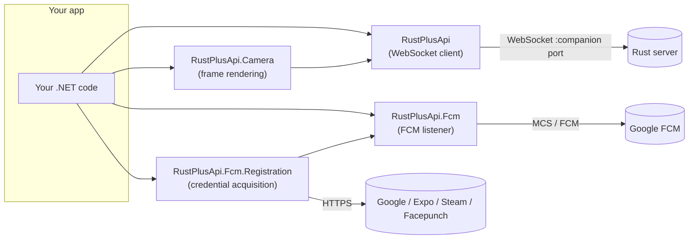
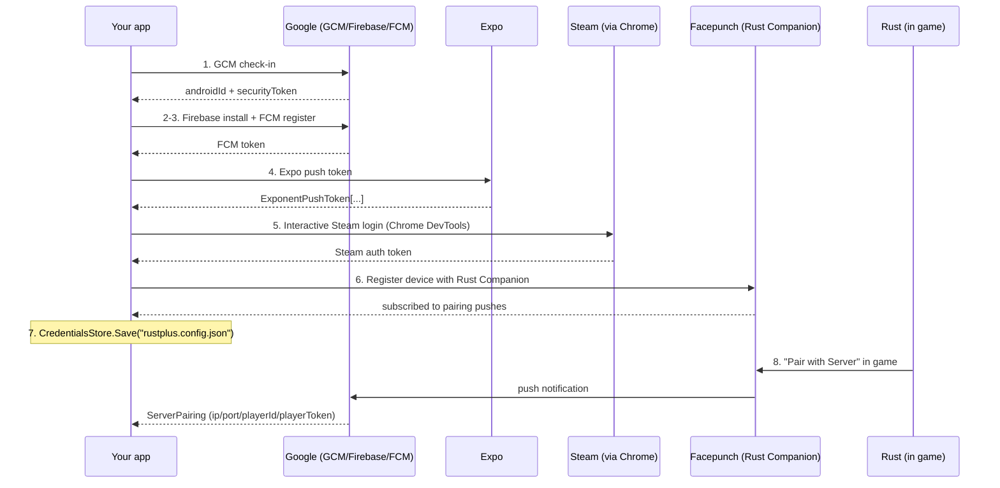
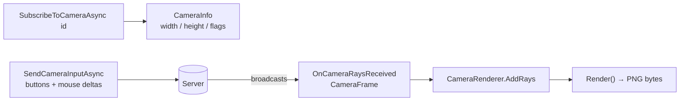

# DocFX Site Redesign & Documentation Expansion — Implementation Plan

> **For agentic workers:** REQUIRED SUB-SKILL: Use superpowers:subagent-driven-development (recommended) or superpowers:executing-plans to implement this plan task-by-task. Steps use checkbox (`- [ ]`) syntax for tracking.

**Goal:** Rust-themed dark DocFX site with a hero landing page, deepened + restructured articles (2 new), and 7 aligned READMEs.

**Architecture:** A custom template *layer* (`docs/template/`) over DocFX's `modern` template — CSS-variable overrides + `main.js` config only, no template fork. Content is plain markdown with built-in mermaid support. Nothing in CI changes (`Documentation.yml` already runs `docfx docs/docfx.json`).

**Tech Stack:** DocFX 2.78.5 (`default` + `modern` + custom layer), Bootstrap 5 CSS variables, mermaid (built into modern template), Google Fonts (Oswald / Inter / JetBrains Mono).

**Spec:** `docs/superpowers/specs/2026-06-10-docfx-site-redesign-design.md`

**Conventions for this plan:**
- ⚠️ **No commits.** The user's standing preference is no `git commit` unless explicitly asked. Use `git mv` for moves (stages the rename) but never commit.
- **The "test" for every task** is `docfx docs/docfx.json` exiting 0 with **no new warnings** (broken xref/links appear as `warning: Invalid file link` / `InvalidFileLink`). Capture warnings before starting (Task 0 below) to compare.
- Verify facts against source before writing API claims. Key files:
  - `src/RustPlusApi/Interfaces/IRustPlus.cs` (all typed methods)
  - `src/RustPlusApi/RustPlus.cs` + `src/RustPlusApi/RustPlusSocket.cs` (events)
  - `src/RustPlusApi.Fcm/Interfaces/IRustPlusFcm.cs`, `src/RustPlusApi.Fcm/RustPlusFcm.cs`, `RustPlusFcmSocketOptions.cs`
  - `src/RustPlusApi.Fcm.Registration/` (FcmRegistration, PairingListener, CredentialsStore, RegistrationConstants)
  - `src/RustPlusApi.Camera/CameraRenderer.cs`
  - `samples/*/Program.cs`

---

### Task 0: Baseline build

**Files:** none (read-only)

- [ ] **Step 0.1:** Run baseline build and save warnings:

```bash
docfx docs/docfx.json 2>&1 | tee /tmp/docfx-baseline.log | grep -i warning
```

Expected: exits 0. Note any pre-existing warnings — those are not ours to fix (but new ones are).

---

### Task 1: Custom template layer

**Files:**
- Create: `docs/template/public/main.css`
- Create: `docs/template/public/main.js`
- Modify: `docs/docfx.json`

- [ ] **Step 1.1: Create `docs/template/public/main.js`:**

```js
export default {
  defaultTheme: 'dark',
  iconLinks: [
    {
      icon: 'github',
      href: 'https://github.com/HandyS11/RustPlusApi',
      title: 'GitHub'
    },
    {
      icon: 'box-seam',
      href: 'https://www.nuget.org/packages/RustPlusApi',
      title: 'NuGet'
    }
  ]
}
```

(Mermaid needs no wiring — the modern template renders ```` ```mermaid ```` blocks natively.)

- [ ] **Step 1.2: Create `docs/template/public/main.css`** with this content (complete file):

```css
@import url('https://fonts.googleapis.com/css2?family=Oswald:wght@500;600;700&family=Inter:wght@400;500;600;700&family=JetBrains+Mono:wght@400;600&display=swap');

/* ---------- palette ---------- */
:root {
  --rp-rust: #ce412b;
  --rp-rust-bright: #e25640;
  --rp-amber: #e8a33d;
  --rp-link-dark: #f08a5c;
}

/* ---------- typography ---------- */
body {
  font-family: 'Inter', system-ui, -apple-system, sans-serif;
}

h1, h2, h3, h4, .navbar-brand {
  font-family: 'Oswald', 'Inter', sans-serif;
  letter-spacing: 0.01em;
}

code, pre, kbd, samp {
  font-family: 'JetBrains Mono', ui-monospace, monospace;
}

/* ---------- dark theme (default) ---------- */
[data-bs-theme="dark"] {
  --bs-body-bg: #171311;
  --bs-body-color: #d8d1c9;
  --bs-secondary-bg: #241e1a;
  --bs-tertiary-bg: #1f1a17;
  --bs-border-color: #3a312b;
  --bs-link-color-rgb: 240, 138, 92;
  --bs-link-hover-color-rgb: 232, 163, 61;
  --bs-primary-rgb: 206, 65, 43;
  --bs-code-color: var(--rp-amber);
}

[data-bs-theme="dark"] body,
[data-bs-theme="dark"] .bg-body {
  background-color: var(--bs-body-bg);
}

[data-bs-theme="dark"] pre {
  background-color: #1f1a17;
  border: 1px solid #3a312b;
}

/* ---------- light theme (warm paper) ---------- */
[data-bs-theme="light"] {
  --bs-body-bg: #faf6f1;
  --bs-body-color: #2e2723;
  --bs-secondary-bg: #f1eae2;
  --bs-tertiary-bg: #f5efe8;
  --bs-border-color: #ddd2c6;
  --bs-link-color-rgb: 178, 49, 27;
  --bs-link-hover-color-rgb: 206, 65, 43;
  --bs-primary-rgb: 206, 65, 43;
}

/* ---------- header / nav ---------- */
header .navbar-brand {
  font-weight: 600;
  text-transform: uppercase;
  letter-spacing: 0.04em;
}

header .navbar-brand:hover {
  color: var(--rp-rust-bright);
}

/* rust underline accent below the header */
header {
  border-bottom: 2px solid var(--rp-rust) !important;
}

/* ---------- buttons ---------- */
.btn-primary {
  --bs-btn-bg: var(--rp-rust);
  --bs-btn-border-color: var(--rp-rust);
  --bs-btn-hover-bg: var(--rp-rust-bright);
  --bs-btn-hover-border-color: var(--rp-rust-bright);
  --bs-btn-active-bg: var(--rp-rust-bright);
  --bs-btn-active-border-color: var(--rp-rust-bright);
}

/* ---------- hero (landing page) ---------- */
.rp-hero {
  text-align: center;
  padding: 4rem 1rem 3rem;
  background:
    radial-gradient(ellipse at 50% -20%, rgba(206, 65, 43, 0.18), transparent 60%),
    radial-gradient(ellipse at 80% 110%, rgba(232, 163, 61, 0.08), transparent 50%);
  border-radius: 1rem;
  margin-bottom: 2.5rem;
}

.rp-hero img {
  width: 96px;
  height: 96px;
  margin-bottom: 1rem;
  filter: drop-shadow(0 0 24px rgba(206, 65, 43, 0.45));
}

.rp-hero h1 {
  font-size: 3rem;
  font-weight: 700;
  text-transform: uppercase;
  letter-spacing: 0.06em;
  margin-bottom: 0.5rem;
}

.rp-hero .rp-tagline {
  font-size: 1.2rem;
  opacity: 0.85;
  max-width: 42rem;
  margin: 0 auto 1.5rem;
}

.rp-hero .rp-cta {
  display: flex;
  gap: 0.75rem;
  justify-content: center;
  flex-wrap: wrap;
  margin-bottom: 1.25rem;
}

.rp-hero .rp-cta .btn {
  padding: 0.6rem 1.6rem;
  font-weight: 600;
}

/* ---------- card grids ---------- */
.rp-grid {
  display: grid;
  grid-template-columns: repeat(auto-fit, minmax(240px, 1fr));
  gap: 1rem;
  margin: 1.5rem 0 2.5rem;
}

.rp-card {
  border: 1px solid var(--bs-border-color);
  border-radius: 0.75rem;
  padding: 1.25rem;
  background: var(--bs-tertiary-bg);
  transition: border-color 0.15s ease, box-shadow 0.15s ease, transform 0.15s ease;
}

.rp-card:hover {
  border-color: var(--rp-rust);
  box-shadow: 0 0 20px rgba(206, 65, 43, 0.25);
  transform: translateY(-2px);
}

.rp-card .rp-card-icon {
  font-size: 1.6rem;
  line-height: 1;
  margin-bottom: 0.5rem;
}

.rp-card h3 {
  font-size: 1.05rem;
  margin: 0 0 0.4rem;
}

.rp-card p {
  font-size: 0.9rem;
  margin: 0;
  opacity: 0.85;
}

.rp-card a {
  text-decoration: none;
}

/* ---------- tables ---------- */
.table thead th, table thead th {
  border-bottom: 2px solid var(--rp-rust);
}

/* ---------- misc ---------- */
article h2 {
  border-bottom: 1px solid var(--bs-border-color);
  padding-bottom: 0.3rem;
  margin-top: 2.2rem;
}

@media (max-width: 576px) {
  .rp-hero h1 { font-size: 2.1rem; }
}
```

- [ ] **Step 1.3: Register the layer in `docs/docfx.json`.** Change the `template` array and tidy global metadata:

```json
    "template": [
      "default",
      "modern",
      "template"
    ],
```

and in `globalMetadata` replace `"_appName": " RustPlusApi"` with `"_appName": "RustPlusApi"`, and `"_appFooter"` with:

```json
      "_appFooter": "<span>RustPlusApi — a C# client for the Rust+ companion API. MIT licensed. <a href=\"https://github.com/HandyS11/RustPlusApi\">GitHub</a> · <a href=\"https://www.nuget.org/packages/RustPlusApi\">NuGet</a></span>",
```

Also exclude the template folder from content globbing — add `"template/**"` to the content `exclude` list:

```json
      { "files": [ "**/*.{md,yml}" ], "exclude": [ "_site/**", "template/**", "superpowers/**", "README.md", "filterConfig.yml" ] }
```

(`superpowers/**` keeps the spec/plan docs out of the site too.)

- [ ] **Step 1.4: Build and verify:**

```bash
docfx docs/docfx.json 2>&1 | grep -iE "warning|error"
```

Expected: no new warnings vs baseline. Spot-check `docs/_site/public/main.css` exists and contains `rp-hero`.

---

### Task 2: Hero landing page

**Files:**
- Modify: `docs/index.md` (full rewrite)
- Copy: repo `icon.png` → `docs/images/logo.png`

- [ ] **Step 2.1:** `cp icon.png docs/images/logo.png`

- [ ] **Step 2.2: Rewrite `docs/index.md`** (complete file — note `_disableToc`/`_disableAffix` front matter so the landing page is full-width):

```markdown
---
_disableToc: true
_disableAffix: true
_disableBreadcrumb: true
---

<div class="rp-hero">
  
  <h1>RustPlusApi</h1>
  <p class="rp-tagline">
    A C# library for the <a href="https://rust.facepunch.com/companion">Rust+</a> companion API.
    Query and control your server, render security cameras, listen for push notifications, and
    acquire all the required credentials natively — <em>no Node.js required</em>.
  </p>
  <div class="rp-cta">
    <a class="btn btn-primary" href="articles/getting-started.html">Get Started</a>
    <a class="btn btn-outline-secondary" href="api/RustPlusApi.html">API Reference</a>
  </div>
  <p>
    
    
    
  </p>
</div>

<div class="rp-grid">
  <div class="rp-card">
    <div class="rp-card-icon">🖥️</div>
    <h3><a href="articles/rustplus-client.html">Server control</a></h3>
    <p>Info, time, map &amp; markers, smart switches, alarms, storage monitors — one typed <code>Response&lt;T&gt;</code> API.</p>
  </div>
  <div class="rp-card">
    <div class="rp-card-icon">💬</div>
    <h3><a href="articles/clan-and-nexus.html">Team &amp; clan</a></h3>
    <p>Read and send team/clan chat, manage the MOTD, react to broadcasts, authenticate with Nexus.</p>
  </div>
  <div class="rp-card">
    <div class="rp-card-icon">📷</div>
    <h3><a href="articles/cameras.html">Cameras</a></h3>
    <p>Subscribe to CCTV, drones and turrets, drive them, and render frames to PNG images.</p>
  </div>
  <div class="rp-card">
    <div class="rp-card-icon">🔔</div>
    <h3><a href="articles/fcm-notifications.html">Notifications</a></h3>
    <p>Receive pairing and alarm pushes over FCM with automatic heartbeat &amp; dead-connection detection.</p>
  </div>
  <div class="rp-card">
    <div class="rp-card-icon">🔑</div>
    <h3><a href="articles/credentials.html">Native credentials</a></h3>
    <p>Acquire FCM + Rust+ credentials end to end in C#, replacing the rustplus.js Node CLI.</p>
  </div>
  <div class="rp-card">
    <div class="rp-card-icon">🎯</div>
    <h3><a href="articles/introduction.html">Broad targeting</a></h3>
    <p>.NET Standard 2.0 and .NET 10 — runs on .NET Framework 4.6.2+, .NET 6–10, Mono and Unity.</p>
  </div>
</div>

## Packages

| Package | | Description |
| --- | --- | --- |
| **[RustPlusApi](api/RustPlusApi.html)** | [](https://www.nuget.org/packages/RustPlusApi) | Core client — typed `Response<T>` API, entities, team/clan/nexus, camera protocol. |
| **[RustPlusApi.Fcm](api/RustPlusApi.Fcm.html)** | [](https://www.nuget.org/packages/RustPlusApi.Fcm) | FCM listener for pairing & alarm notifications. |
| **[RustPlusApi.Fcm.Registration](api/RustPlusApi.Fcm.Registration.html)** | [](https://www.nuget.org/packages/RustPlusApi.Fcm.Registration) | Native credential acquisition (no Node.js). |
| **[RustPlusApi.Camera](api/RustPlusApi.Camera.html)** | [](https://www.nuget.org/packages/RustPlusApi.Camera) | Renders camera frames into images (ImageSharp). |

## Quickstart

```csharp
using RustPlusApi;

using var rustPlus = new RustPlus(server, port, playerId, playerToken);
await rustPlus.ConnectAsync();

var info = await rustPlus.GetInfoAsync();
if (info.IsSuccess)
    Console.WriteLine($"{info.Data!.Name} — {info.Data.PlayerCount}/{info.Data.MaxPlayerCount}");
```

Don't have credentials yet? The **[Getting Started](articles/getting-started.html)** guide walks
you through acquiring them natively in a couple of minutes.
```

> Note: if `api/RustPlusApi.Fcm.Registration.html` / `api/RustPlusApi.Camera.html` don't exist
> under those exact names, check `docs/_site/api/` after a build and fix the hrefs (the metadata
> step generates one page per namespace).

- [ ] **Step 2.3: Build and eyeball:**

```bash
docfx docs/docfx.json --serve --port 8080
```

Open http://localhost:8080 — hero renders centered, cards glow on hover, dark by default. Stop the server after checking. No new warnings.

---

### Task 3: TOC restructure + Development section

**Files:**
- Modify: `docs/toc.yml`, `docs/articles/toc.yml`
- Move: `docs/testing.md` → `docs/development/testing.md` (`git mv`)
- Create: `docs/development/toc.yml`, `docs/development/building-docs.md`
- Modify: `docs/README.md` (layout table), any files referencing `docs/testing.md`

- [ ] **Step 3.1: `docs/toc.yml`** (complete file):

```yml
- name: Articles
  href: articles/
- name: Development
  href: development/
- name: API
  href: api/
```

- [ ] **Step 3.2: `docs/articles/toc.yml`** (complete file — sectioned):

```yml
- name: Get Started
  items:
    - name: Introduction
      href: introduction.md
    - name: Getting Started
      href: getting-started.md
    - name: Credentials
      href: credentials.md
- name: Guides
  items:
    - name: RustPlus Client
      href: rustplus-client.md
    - name: Clan & Nexus
      href: clan-and-nexus.md
    - name: Cameras
      href: cameras.md
    - name: FCM Notifications
      href: fcm-notifications.md
- name: Resources
  items:
    - name: Samples
      href: samples.md
    - name: Recipes
      href: recipes.md
    - name: Troubleshooting
      href: troubleshooting.md
```

(`recipes.md` / `troubleshooting.md` are created in Task 6 — DocFX will warn about the missing files until then; that's expected mid-plan. If executing tasks strictly one at a time, create empty stubs with just an `# Recipes` / `# Troubleshooting` heading now.)

- [ ] **Step 3.3:** `git mv docs/testing.md docs/development/testing.md` (create the dir first: `mkdir -p docs/development`).

- [ ] **Step 3.4:** Fix inbound links: `grep -rn "docs/testing.md\|testing.md" --include="*.md" --include="*.yml" --include="*.csproj" --include="*.props" . | grep -v _site | grep -v node_modules` and update every hit to the new path.

- [ ] **Step 3.5: Create `docs/development/toc.yml`:**

```yml
- name: Testing & Quality
  href: testing.md
- name: Building the Docs
  href: building-docs.md
```

- [ ] **Step 3.6: Create `docs/development/building-docs.md`** — a site-facing version of `docs/README.md`: prerequisites (.NET 10 SDK, `dotnet tool install --global docfx`), build/serve commands, layout table including the new `template/` and `development/` folders, note that GitHub Pages deploys from `main` via `Documentation.yml`. Keep `docs/README.md` as the short repo-facing pointer (update its layout table to match and link to this page).

- [ ] **Step 3.7: Build:** `docfx docs/docfx.json` — top nav shows Articles / Development / API; sidebar shows the three article sections. Only acceptable warnings: missing recipes/troubleshooting if stubs weren't created.

---

### Task 4: Deepen the Get Started articles

**Files:**
- Modify: `docs/articles/introduction.md`, `docs/articles/getting-started.md`, `docs/articles/credentials.md`

- [ ] **Step 4.1: `introduction.md`** — keep existing content, add after "The packages" table a mermaid architecture diagram:

````markdown

````

Also expand "How it fits together" into a short narrated walkthrough that links each step to its article.

- [ ] **Step 4.2: `getting-started.md`** — add a **Prerequisites** section (a .NET SDK; Chrome/Chromium for the one-time registration; a Rust server you play on with Rust+ enabled), and a **"What the four values are"** table (`server`, `port`, `playerId`, `playerToken` — where each comes from), and a final **"If something doesn't work"** link to `troubleshooting.md`. Keep the existing 1-2-3 flow.

- [ ] **Step 4.3: `credentials.md`** — replace the step table's prose neighbour with a mermaid sequence diagram (keep the table too):

````markdown

````

Expand the Chrome section with the exact discovery order (native → Flatpak → `CHROME_PATH`) verified against the source in `src/RustPlusApi.Fcm.Registration/` (read `SteamLoginService`/browser-discovery code first; adjust wording to match reality).

- [ ] **Step 4.4: Build:** no new warnings; serve and confirm both diagrams render (mermaid runs client-side — check in the browser, not the raw HTML).

---

### Task 5: Deepen the guide articles

**Files:**
- Modify: `docs/articles/rustplus-client.md`, `docs/articles/clan-and-nexus.md`, `docs/articles/cameras.md`, `docs/articles/fcm-notifications.md`

- [ ] **Step 5.1: `rustplus-client.md`** — make the method reference complete. Read `src/RustPlusApi/Interfaces/IRustPlus.cs` and ensure **every** method appears in exactly one grouped table with its full signature-relevant info (params + return type). Groups: *Server & world* (GetInfo/GetTime/GetMap/GetMapMarkers), *Entities* (GetSmartSwitchInfo/GetAlarmInfo/GetStorageMonitorInfo/SetSmartSwitchValue/Toggle/Strobe/CheckSubscription/SetSubscription), *Team* (GetTeamInfo/GetTeamChat/SendTeamMessage/PromoteToLeader), *Clan* (GetClanInfo/GetClanChat/SendClanMessage/SetClanMotd), *Nexus* (GetNexusAuth), *Cameras* (SubscribeToCamera/SendCameraInput/UnsubscribeFromCamera), *Low-level* (SendRequestAsync). Use a three-column table: Method | Returns | Notes. Add a **Connection lifecycle** section (mermaid stateDiagram: Disconnected → Connecting → Connected → Disconnecting → Disconnected, with ErrorOccurred edge) and a complete **Events** table (read `RustPlus.cs`/`RustPlusSocket.cs` for the authoritative list) with one row per event: Event | Payload type | Fires when.

- [ ] **Step 5.2: `clan-and-nexus.md`** — add a `ClanInfo` property table (read `src/RustPlusApi/Data/` clan types), document role/member sub-objects, and clarify when `OnClanChanged` fires vs `OnClanChatReceived`. Keep existing snippets.

- [ ] **Step 5.3: `cameras.md`** — add a pipeline mermaid diagram:

````markdown

````

Add an **Identifiers** section (CCTV codes like `CAM01` are set on the camera in game; drones/turrets use their own ids) and a `CameraControlFlags` table (read `src/RustPlusApi/Data/Cameras/CameraControlFlags.cs`). Keep the Experimental warning, formatted as a DocFX alert (`> [!WARNING]`).

- [ ] **Step 5.4: `fcm-notifications.md`** — add a small mermaid flow (game pairs → Facepunch → FCM → RustPlusFcm event), a **Reconnect strategy** section with a complete copy-pasteable example (on `ErrorOccurred` with `TimeoutException`: dispose, recreate `RustPlusFcm` with saved `persistentIds`, reconnect with backoff), and convert the heartbeat note to a `> [!NOTE]` alert. Verify event list against `IRustPlusFcm.cs`.

- [ ] **Step 5.5: Build + browser check** of all four pages (diagrams render, tables intact).

---

### Task 6: New articles — Recipes & Troubleshooting

**Files:**
- Create: `docs/articles/recipes.md`, `docs/articles/troubleshooting.md`

- [ ] **Step 6.1: `recipes.md`** — self-contained, copy-pasteable snippets, each verified against the real API surface (compile mentally against `IRustPlus.cs` — correct method names, `Response<T>` checks, disposal). Sections:
  1. **React to an alarm by flipping a switch** — `RustPlusFcm.OnAlarmTriggered` + `RustPlus.SetSmartSwitchValueAsync`.
  2. **Save the server map to disk** — `GetMapAsync` → write `Data.Image` bytes (check actual property name in `ServerMap`) to `map.jpg`.
  3. **Minimal team-chat echo bot** — `OnTeamChatReceived` + `SendTeamMessageAsync`, with a guard against echoing its own messages.
  4. **Camera snapshot loop** — subscribe, accumulate N frames in `CameraRenderer`, save PNG, unsubscribe.
  5. **Persist & reload credentials** — `CredentialsStore.Save`/`Load` + `PairingListener`.

- [ ] **Step 6.2: `troubleshooting.md`** — FAQ format, each item a `##` heading phrased as the symptom. Cover at minimum:
  - *Connection refused / times out* — companion port ≠ game port; where to find it; `useFacepunchProxy: true` when the server blocks direct connections.
  - *Pairing notification never arrives* — registration must complete first; check `OnPairing` raw event; persistentIds skipping; re-pair in game.
  - *Chrome/Chromium not found* — discovery order, `CHROME_PATH`, Firefox/Safari won't work and why.
  - *Registration fails mid-chain* — upstream drift, re-check `RegistrationConstants`, fall back to `npx @liamcottle/rustplus.js fcm-register`.
  - *Entity events never fire* — must request the entity once (`GetSmartSwitchInfoAsync(id)`) to subscribe to its broadcasts.
  - *`ErrorOccurred` with `TimeoutException` after ~12 minutes* — inactivity watchdog; tune `RustPlusFcmSocketOptions`; reconnect pattern (link to FCM article).
  - *`playerToken` stopped working* — tokens rotate when you re-pair; get fresh values.
  Verify each claim against source/articles before writing; link related guides.

- [ ] **Step 6.3: Build:** the Task 3 TOC warnings for these two files disappear; zero new warnings overall.

---

### Task 7: README alignment (7 files)

**Files:**
- Modify: `README.md`, `src/RustPlusApi/README.md`, `src/RustPlusApi.Fcm/README.md`, `src/RustPlusApi.Fcm.Registration/README.md`, `src/RustPlusApi.Camera/README.md`, `samples/README.md`, `docs/README.md`

These were refreshed for v2 and are close already — this is alignment, not rewrite. NuGet renders a markdown subset: keep package READMEs to plain markdown + `<div align="center">` at most; shields.io images are allowed.

- [ ] **Step 7.1: Root `README.md`:**
  - In the **Documentation** section add the two new article links (Recipes, Troubleshooting) alongside Getting Started.
  - Add a NuGet version badge row consistency check (already present — leave).
  - Verify the `samples/README.md` and docs-site links still resolve.

- [ ] **Step 7.2: Package READMEs (4)** — apply a uniform skeleton, preserving each file's existing accurate prose:
  1. `# <PackageName>` + one-paragraph value statement (keep current text).
  2. `**Part of [RustPlusApi](https://github.com/HandyS11/RustPlusApi)** · [Documentation](https://handys11.github.io/RustPlusApi/) · [Samples](https://github.com/HandyS11/RustPlusApi/tree/develop/samples)` line directly under the intro — this is the alignment change.
  3. Targets line, `## Install`, `## Usage`, package-specific sections, `## Documentation` links (add Troubleshooting link to all four).
  Check ordering/headings match across all four files.

- [ ] **Step 7.3: `samples/README.md`** — add a pointer to the Samples article on the docs site at the top; otherwise content stands.

- [ ] **Step 7.4: `docs/README.md`** — already updated in Task 3 (layout table); double-check it mentions `template/` (custom theme), `development/`, and links to `building-docs.md` on the site.

- [ ] **Step 7.5:** Link check: `grep -rn "handys11.github.io" README.md src/*/README.md samples/README.md` — every URL path must correspond to a page that exists in `docs/_site/` after a build (articles moved? testing.md moved to development/).

---

### Task 8: Final verification

**Files:** none

- [ ] **Step 8.1:** Clean build: `rm -rf docs/_site docs/api/*.yml && docfx docs/docfx.json 2>&1 | grep -icE "warning"` → compare with `/tmp/docfx-baseline.log`; zero **new** warnings.

- [ ] **Step 8.2:** `docfx docs/docfx.json --serve --port 8080` and with the browser MCP (playwright or chrome-devtools) screenshot and review:
  - Landing page, dark (default) — hero, cards, packages table.
  - Landing page, light (toggle) — warm paper tint, readable.
  - `articles/credentials.html` — mermaid sequence diagram rendered (not a raw code block).
  - `articles/rustplus-client.html` — tables styled, state diagram rendered.
  - An API page (e.g. `api/RustPlusApi.RustPlus.html`) — dark theme doesn't break generated reference markup.
  - Narrow viewport (≈ 390px wide) — hero scales, nav collapses.
  - Search box returns results (e.g. search "camera").
- [ ] **Step 8.3:** Fix anything the screenshots reveal (CSS selector drift against the modern template is the expected class of issue), rebuild, re-screenshot.
- [ ] **Step 8.4:** Report results to the user with the screenshots' findings. **Do not commit** — leave the working tree for the user to review.

---

## Self-review notes

- **Spec coverage:** §1 template layer → Task 1; §2 landing → Task 2; §3 articles + TOC + testing.md → Tasks 3–6; §4 READMEs → Task 7; §5 risks (mermaid wiring now known-built-in; CSS drift handled by Task 8 screenshot loop; NuGet markdown subset noted in Task 7); §6 verification → Tasks 0 & 8. No gaps.
- **Consistency:** custom classes `rp-hero`/`rp-grid`/`rp-card` defined in Task 1 CSS and consumed only in Task 2 HTML. Template folder name `template` matches the docfx.json entry. `development/` paths consistent across Tasks 3 and 7.
- **Deviation from plan-format norms, deliberate:** no commit steps (user's standing no-auto-commit preference) and prose articles are specified by concrete outline + embedded diagrams/tables rather than full final text — the executor authors prose against the named source files, which are the ground truth.
